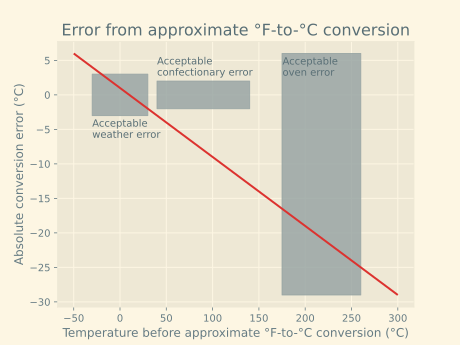

---
title: Back-of-envelope temperature conversion
publication-date: 2024-09-09
last-edit-date: 2024-09-09
...

Living in Canada is a bizarre experience. As we approach the 55th anniversary of
the beginning of metrication in Canada, I still frequently experience talking
about the weather in Celsius, oven temperatures in Fahrenheit, bread-baking
recipes in Celsius, candy-making temperatures in Fahrenheit, but water
phase-changes in Celsius (is there really any other option for this case?).

However, the conversion formula between these systems is surprisingly
straightforward:

```math
^\circ \mathrm{C} = \frac{5}{9}(^\circ \mathrm{F} - 32)
```

These numbers are difficult to remember on-the-fly. One approach is to round
them to easier-to-remember (and compute) values:

```math
^\circ \mathrm{C} \approx \frac{1}{2}(^\circ \mathrm{F} - 30) = \frac{1}{2}{^\circ \mathrm{F}} - 15
```

If I am presented with a Fahrenheit temperature value in the wild, and want a
ballpark estimate of its value in Celsius, I can use this second formula. What
error do I introduce into my conception of the world, however? I decided to plot
it! Below is the error of this approximate °F-to-°C formula, with both axes in
Celsius (this post is, after all, for those who deal with Celsius consistently):



I included some typical temperature ranges humans deal with, together with the
errors we tolerate in those contexts. For the weather, being off by 3°C is not
bad when deciding how to dress. When baking in an oven, most recipe tolerances
are in the ±30°C range, so this approximation is also sufficient.

Where you might want a more precise conversion is in the confectionery world.
For candy-making, some tolerances are within 3°C, while chocolate tempering can
be similarly precise. (My experience in these areas is extremely limited, and my
numbers are derived from a cursory glance at a few recipe websites.)
