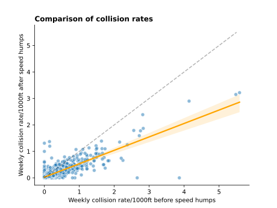

---
title: Jesse Frohlich
...


# Jesse Frohlich

<div class="icons">
  <a
    href="https://www.linkedin.com/in/jesse-frohlich"
    target="_blank"
    rel="noopener noreferrer"
  >
    <svg fill="currentColor">
      <title>LinkedIn</title>
      <use href="/header/images/linkedin.svg#icon"></use>
    </svg>
  </a>
  <a href="hidden" class="email" target="_blank" rel="noopener noreferrer">
    <svg fill="currentColor">
      <title>Email</title>
      <use href="/header/images/envelope.svg#icon"></use>
    </svg>
  </a>
  <a href="https://github.com/phro" target="_blank" rel="noopener noreferrer">
    <svg fill="currentColor" alt="LinkedIn">
      <title>GitHub</title>
      <use href="/header/images/github.svg#icon"></use>
    </svg>
  </a>
</div>

## About me

I am a Math PhD, programmer, and complex problem-solver always up for hearing a
pun or getting on a bicycle.

I am driven by improving people’s lives through technology, and am seeking to
solve difficult problems in a motivated environment surrounded by other talented
people. I am seeking opportunities to work in software engineering and data
science.

## Programming

I like solving problems with code. I have worked with several languages over the
years, including Python, C&NoBreak;+&NoBreak;+, Haskell, Asymptote, Rust,
Javascript / TypeScript, SQL, Lua, and PHP. Most of my programming projects are
on [GitHub](https://github.com/phro), with a summary of selected projects below:

### [Analysing road safety](https://www.erdosinstitute.org/project-database/spring-2024/data-science-boot-camp/analysing-road-safety)

The purpose of this project was to predict collision rates in New York City
using public road data and other geological features, and to identify key road
infrastructures that can improve safety as economically as possible. Global
analysis determined that traffic volume and street width were important factors,
and individual feature analysis of speed humps determined that they reduce the
collision rate by half!



### [Toki Pona syntax parser](https://github.com/phro/dcl)

The project goal was to implement a syntax parser for a human language. Using
Haskell, I led our team to define production rules for a majority of the 140+
words and phrase structures in the constructed human language Toki Pona. To
improve interactiveness, we added a visualisation of the resulting tree.

An example of the output is below (The input translates roughly to "I like
you"):

```
$ dcl "mi wile e sina"
Start
│
├─ Subject Phrase
│  │
│  └─ mi
│
└─ Predicate
   │
   ├─ Content
   │  │
   │  └─ wile
   │
   └─ Preposition Cluster
      │
      ├─ Preposition
      │  │
      │  └─ e
      │
      └─ Content
         │
         └─ sina

```

## PhD Thesis

I received my PhD in mathematics from the University of Toronto.
[My thesis](https://github.com/phro/thesis/releases/download/v1.0.0/thesis-electronic-v1_0_0.pdf)
was in algebraic knot theory. The project goal was to expand an efficient
implementation of a strong knot invariant to a larger class of objects.

I implemented novel algorithms and evaluated them on over 2000 test cases, and
discovered a novel structure in the resulting data, which opened new avenues for
research. Much of my work I implemented in software,
[extending a mathematica package](https://github.com/phro/GDO/https://github.com/phro/GDO/https://github.com/phro/GDO/),
and [writing a portion in Haskell](https://github.com/phro/KnotTheory).
